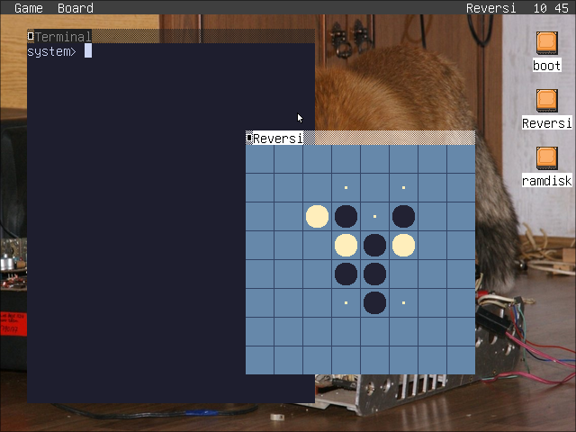

# Reversi for fox32os

The staple computer game of classic Windows. Currently supports two-player play with plans to include an AI opponent.

## Building and Running

This project is written in [Olea](https://github.com/OliveIsAWord/olea), a custom programming language. The fox32 tools `fox32asm` and `ryfs` are needed to build the app image. Building also requires rust-script, make, and awk.

## See Also

https://youtu.be/DgJS2tQPGKQ
